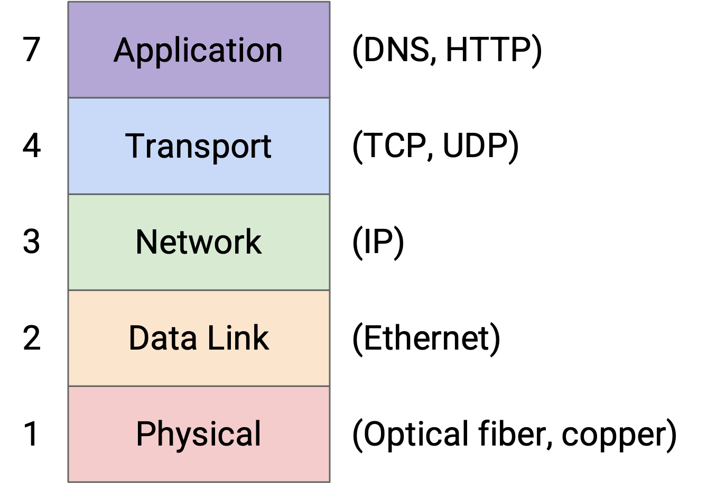
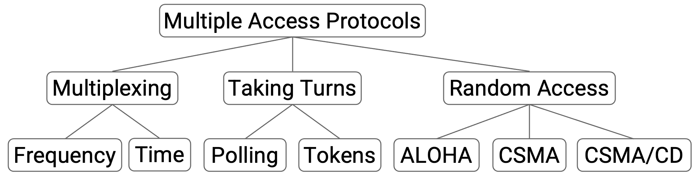

# CS168 Notes

## Intro
### Layers of the Internet
internet design challenges
- fedoration
- scale
- evolution
- diversity
- asynchrony
- fault tolerance

protocol
- syntax
- semantics

layer 1 - physical(moving bits across space)  
need some physical technology

layer 2 - link(local networks)  
links between machines  
exchange packets

layer 3 - internet(connecting local networks)  
the Internet is a network of networks  
end hosts: machines  
switches(aka routers): receive packets and forward them toward destination  
modularity  
layer 3 offers a best-effort service model  
not promissing success

layer 4 - transport(reliably deliver packets)  
thinking about flows(aka connections)

layer 7 - application(implement services)

> The session layer (5) was supposed to assemble different flows into a session (e.g. loading various images and ads to form a webpage), and the presentation layer (6) was supposed to help the user visualize the data. Today, the functionality of these layers is mostly implemented in Layer 7.

headers  
packet needs some extra metadata  
packet = headers + payload

multiple headers

end hosts implement all the layers  
rounters only implement layers 1-3

### Design Principles
1. decentralized control  
    alternative: SDN, DSDN
2. best-effort services model  
    alternative: introduce "quality-of-service" guarantees
3. route around trouble
4. dumb infrastructure(with smart endpoint)  
    alternative: routers look inside to detect attacks
5. end-to-end principle
6. layering  
    alternative: protocols spanning multiple layers to optimize
7. federation via narrow-waist interface

the narrow waist: IP(internet protocol) is the only protocol at layer 3

demultiplexing:  
layer 3: add header field tell what the next layer protocol is  
layer 4: add a port number  
private client use randomly-generated port number  
public server must use a fixed, well-known port number

logical port and physical port

implement layers in the end host  
layers 1 and 2 are implemented in hardware, on the network interface card(NIC)  
layers 3 and 4 are implemented in software, in the operating system  
layer 7 is the applications running in software

end-to-end principle: certain application features(e.g. reliability) must be implemented at the end host for correctness  
it's not an unbreakable rule

designing resource sharing  
- static allocation(fixed)
- statistical multiplexing(dynamic)
    - circuit switching(reservations)  
    used in limited settings
    - packet switching(best-effort)  
    default

### Links
properties of a link
- bandwidth  
    measured in bits per second(bps)
- propagation delay  
    measured in seconds
- bandwidth-delay product: bandwidth x delay  
    "capacity" of the link

overloaded links
- transient overload  
    maintain a queue of packets
- persistent overload
    drop packets  
    upgrade router or tell the sender to slow down

packet delay = transmission delay(packet size / bandwidth) + propagation delay + queuing delay

## Routing
### Principle
full-mesh topology doesn't scale well, but high bandwidth  
single-link topology  
network graph is constantly changing  
routing protocols is distributed

- intra-domain routing protocols(interior gateway protocols(IGPs))
- inter-domain routing protocols(exterior gateway protocols(EGPs))  
    the Internet use BGP

in practice, the lines between intra and inter are blurred

destination-based forwarding  
depend on the destination field of the packet  
router keeps a forwarding table

forwarding(deliver packets) vs. routing(fill tables)

a global routing state is valid if and only if there are no dead ends and no loops

directed delivery tree  
oriented spanning tree

least-cost routing

some table entries can be hard-coded(no routing protocols needed)

static routes

### Distance-Vector
routing and forwarding are opposite

distance-vector protocol rule
1. Bellman-Ford updates(distributed and asynchronous)  
    advertising or announcing in routing
2. updates from next-hop  
    topology can change  
    steady-state occurs when the network has converged
3. resending
4. expiring  
    set TTL
5. poisoning expired routes  
    poison: from routes time out or local failure
6. split horizon or poison reverse
7. count to infinity
```
For each destination:

    - If you hear an advertisement for that destination, update the table and reset the TTL if:
        The destination isn’t in the table.
        The advertised cost, plus the link cost to the neighbor, is better than the best-known cost.
        The advertisement is from the current next-hop. Includes poison advertisements.
    - Advertise to all your neighbors when the table updates, and periodically (advertisement interval).
        But don’t advertise back to the next-hop.
        …Or, advertise poison back to the next-hop.
        Any cost greater than or equal to 16 is advertised as infinity.
    - If a table entry expires, make the entry poison and advertise it.
```

- triggered update
   - accept new advertisement
   - a new link added
   - a link goes down
   - expire
- periodically

### Link-State, Addressing
routing protocol classified by how to operate
- distance-vector
- link-state(common as intra-domain)  
    examples: IS-IS, OSPF
- path-vector

global data and local computation

ensuring consistency  
requirements
1. everyone agrees on the network topology
2. everyone is minimizing the same cost metric
3. all costs are positive
4. all routers use the same tie-breaking rules

learning network graph  
every router:
1. discover neighbors
2. tell everybody about neighbors
    flood information

avoiding infinite flooding  
introduce a timestamp

ensuring reliability

ip addressing(at layer 3)  
hierarchical addressing  
host in current network(intra-domain) + other networks(inter-domain)  
*.* wildcard is the default route

assigning addresses  
early internet -> classful addressing -> CIDR(classless inter-domain routing)  
network id + host id

multi-layered hierarchical assignment

dotted quad representation  
slash notation  
netmask

aggregating routes with CIDR

multi-homing  
longest prefix matching

IPv4 and IPv6 addresses

### Routers
colocation facilities

line rate  
capacity = number of ports * line rate of each port

components
- data plane
- control plane
- management plane  
    use network management system(NMS)

chassis, controller card, linecard  
each linecard is connected to the fabric

types of packets
- user packet
- control plane traffic  
    example: advertisement
- punt traffic  
    example: TTL has expired

linecard functionality: PHY(layer 1) -> MAC(layer 2)

forwarding in hardware  
forwarding pipeline
1. receive the packet
2. process the packet
3. send the packet onwards

queuing
- classification
- buffer management
- scheduling

efficient forwarding

longest prefix match with tries

### BGP
autonomous system(AS)
- stub AS
- transit AS

inter-domain topology(AS graph)

provider hierarchy

tier 1 ASes

goals of inter-domain routing
- scalability
- privacy
- autonomy

policy-based routing  
gao-redford rules: multiple path, pick the most profitable one  
properties: single-peaked, reachability, convergence

BGP(border gateway protocol)  
importing  
    customer > provider > peer  
exporting
- if receive a router from a customer, export it to everyone
- if from a peer or provider, only export it to a customer

aggregating prefixes

path-vector: advertise the whole AS path

stub ASes use default routes

border routers and interior routers  
BGP speaker  
BGP session
- external BGP(eBGP) session
- internal BGP(iBGP) session

egress router

BGP and IGP routing tables

multiple links between ASes  
-> hot potato routing

multi-exit discriminator(MED)

importing and exporting with tiebreaking policies

hot potato routing and MED are contradictory

BGP message type
- Open
- KeepAlive
- Notification
- Update
    - destination prefix
    - one or more route attributes
        - ASPATH
        - LOCAL PREFERENCE
        - MED

issues of BGP
- security
- performance trade-offs
- complicated and prone to misconfiguration
- invalid routes

ipv4 header
1. parse the packet
2. forward packet to the next hop
3. tell the destination what to do next
4. send responses back to the source
5. handle errors
6. specify any special packet handling

maximum transmission unit(MTU)

ipv6
1. eliminate checksums
2. eliminate fragmentation
3. eliminate options, add next header
4. add flow label

ip attack
- source ip address: spoofing
- type of service: prioritize attacker traffic
- fragmentation, options: denial-of-service
- ttl: traceroute
- protocol, checksum: no apparent problems

## Transport
### TCP
dropped, corrupted, reordered, delayed and duplicated

at-least-once delivery

demultiplexing by introducing port numbers

> Servers usually listen for requests on well-known ports (port numbers 0-1023). Clients can select their own random port numbers (usually port numbers 1024-65535)

TCP and bytestream abstraction  
UDP and datagrams

round-trip time(RTT)

acknowledgment(ack) and timer  
negative acknowledgement (nack) and checksum  

window-based algorithms: set a limit W and say that only W packets can be in flight at any given time

Window Size:  
filling the pipe: W = RTT times bandwidth  
flow control: advertised window  
congestion control

individual ack  
full information ack  
cumulative ack

data → segment/datagram → packet → frame → bit

TCP segment  
MSS(TCP segment limit) = MTU(IP packet limit) - IP header size - TCP header size

the ISN is chosen to be random for security reasons

TCP connections are full duplex

three-way handshake  
- SYN message  
- SYN-ACK message  
- ACK message

piggybacking: the recipient could wait until it has some data to send, and then send the ack with the new data.  
such as SYN-ACK

TCP header

### Congestion Control
congestion control algorithm need learn about the bandwidths and bottenedes along the path, need to be adaptive to changes in network topologycongestion control algorithm

goals: efficient, fair, scalable and decentralized

dynamic adjustment
- host-based
  - loss-based
  - delay-based
- router-assisted

host-based algorithm
```
sending at a rate R for some period of time
if experience congestion
    reduce R
else
    increase R
```

detecting congestion
- check for packet loss (commonly used by TCP)  
  but bad in corruption and arrive late
- check packet delay

discovering initial rate
- AIAD
- AIMD(best)
- MIAD
- MIMD

recipient sends RWND (receiver window)  
sender maintains CWND (congestion window)  
so window = min\{RWND, CWND\}

window size = rate × RTT

event-driven updates  
- new ack: increase window size  
- 3 duplicate acks: decrease window size  
- timeout: back to slow-start phase(TCP)

event-driven slow start  
choose a slow rate and increase exponentially  
once receiving ack, increase window size  
save SSTHRESH(slow start threshold)

additive increasing  
receive ack -> CWND = CWND + 1/CWND

multiplicative decrease  
detect loss from 3 duplicate acks, divide the window size by 2

fast recovery  
use extend window  
set SSTHRESH = CWND / 2

TCP congestion control variants
- TCP Tahoe
- TCP Reno
- TCP New Reno
- TCP-SACK

throughput: $\frac{3}{4} W_{max}\cdot \frac{MSS}{RTT}$  
loss rate: $p=\frac{8}{3W_{max}^2}$

rate-based congestion control  
equation-based  
TCP-friendly

issues
- confusing corruption and congestion
- short connections
- TCP fills up queues: learn minimum RTT(BBR)
- cheating

router-assisted  
enforcing fair queuing  
Explicit Congestion Notification(ECN) in the IP header

## Applications
### DNS
Domain Name System  
name server hierarchy  
stub resolvers and recursive resolvers  
redundancy: multiple name servers  
use UDP  

records in DNS (3-tuple <Name, Class, Type>)
- A type: map domains to IPv4 addresses
- AAAA type: map domains to IPv6 addresses
- NS: map zones to domains
- CNAME: for aliasing or redirecting

DNS authority hierarchy

anycast: many mirrors and use the same IP address for all of them

DNS for Email  
`MX` type records: map domains to mail servers  
`MX` records contain a priority

DNS for load balancing  
receive multiple A type records, mapping a single domain to multiple IP addresses  
PTR type record: map IP address to name

### HTTP (HTTP/1.1)
runs over TCP  
- a client-server protocol
- a request-response protocol
    
HTTP: port 80  
HTTPS: port 443

HTTP requests
- method
    - GET
    - POST
    - HEAD
    - PUT
    - CONNECT
    - DELETE
    - OPTIONS
    - PATCH
    - TRACE
- URL
- version
- optional content

end with a newline (CRLF)
    
with other methods like POST, need a URL to indicate how to interpret

HTTP responses(request corresponds to a response)
- version
- status code
    - 100 informational responses
    - 200 successful responses
        - 200 OK
        - 201 Created
    - 300 redirection messages
        - 301 Moved Permanently
        - 302 Found
    - 400 an error attributable to client action
        - 401 Unauthorized
        - 403 Forbidden
        - 404 Not Found
    - 500 an error attributable to server action
        - 500 Internal Server Error
        - 503 Service Unavailable
- optional message
- content

HTTP Headers  
additional metadata

speeding up HTTP
- pipelining
- caching
    - private caches
    - proxy caches
    - managed caches

Expires header
Cache-Control header

content delivery networks (CDNs)

HTTPS is an extension to HTTP, and runs on top of TLS (transport layer security)

HTTP/2.0

HTTP/3.0 run over QUIC (quick UDP connections)

## End-to-End

### Ethernet
bus topology: connect all the computers along a single wire  
shared media


multiple access protocols
- multiplexing
    - frequency
    - time
- taking turns
    - polling: a centralized coordinator  
        Bluetooth
    - tokens: a virtual token  
        IBM Token Ring  
        FDDI
- random access
    - ALOHA
    - CSMA (Carrier Sense Multiple Access)
    - CSMA/CD (with Collision Detection)
        use binary exponential backoff
