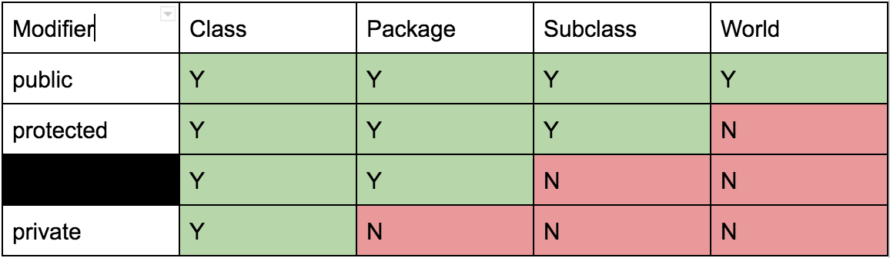

# CS61B notes

## Introduction to Java
### Essentials
.java -> `javac(compiler)` -> .class - > `java(interpreter)` -> stuff happens  
all variables and expressions have a `static type`
### Objects
static vs. non-static  
array of objects  
class methods vs. instance methods  
static variables should be accessed using the name of the class

## Lists
the golden rule of equals(GRoE)  
primitive types: `byte`, `short`, `int`, `long`, `float`, `double`, `boolean`, `char`  
others: reference type
- IntList
- SLList(NestedClasses: IntNode)
- DLList
- ArrayList(dynamic size)

## Testing
test method/class  
Junit  
Test-Driven Development  
Integrating Testing

## Inheritance, Implements
`implement` interface class  
`extends` all instance variables, static variables, all methods, all nested classes
> Note that constructors are not inherited, and private members cannot be directly accessed by subclasses.

Hypernyms Hyponyms  
is-a relationship  
overloading  
@Override  
default method identify how hypernym should behave(can be override)  
dynamic type depend on what in box  
> When Java runs a method that is overriden, it searches for the appropriate method signature in it's dynamic type and runs it.

> Every class in Java is a descendant of the Object class.
```
// Object Class
String toString()
boolean equals(Object obj)
Class <?> getClass()
int hashCode()
protected Objectclone()
protected void finalize()
void notify()
void notifyAll()
void wait()
void wait(long timeout)
void wait(long timeout, int nanos)
```
type checking and casting  
highter-order functions  
Subtype Polymorphism  
Comparable\<T>/Comparator\<T>
### Java libraries
- List
- Set
- Map

`abstract` classes: cannot be instantiated(seems like interface + class)
### Package
appending the class to a website address (backwards)

## Generics and Autoboxing
ArrayList\<int>(×)  
ArrayList\<Integer>(√)  
Arrays are never autoboxes or auto-unboxed  
Similar to the autoboxing/unboxing process, Java will also automatically widen a primitive if needed.  
An immutable data type is a data type whose instances cannot change in any observable way after instantiation.  
`final` can prevent variables being changed after its first assignment  
> The K extends Comparable\<K> means keys must implement the comparable interface and can be compared to other K's.

## Exceptions, Iterators, Iterables, Object Methods
throw exceptions is better  
enhanced for loop: Iterator\<T>(Object), Iterable\<T>(Interface)

## Packages and access control
file name -> package name
### access control


## Efficient Programming
### Asymptotics
Big-Omega <= Big-theta <= Big-O  
dynamic array amortized the time

## Disjoint Sets
- quick find
- quick union
- weighted quick union(WQU)
- WQU with path compression

## ADTs
common use:
  - Stacks
  - Lists
  - Sets
  - Maps
  - Tree

## Tree
binary search tree(can use to implement set and map)  
B-tree(2-3-4/2-3 Trees)  
Tree Rotation  
Red-Black tree  
Properties of LLRB's:
  - 1-1 correspondence with 2-3 trees.
  - No node has 2 red links.
  - There are no red right-links.
  - Every path from root to leaf has same number of black links (because 2-3 trees have same number of links to every leaf).
  - Height is no more than 2x height of corresponding 2-3 tree.

## Hashing
`.hashCode()`  
Two objects that are considered `.equal()` must have the same hash code.  
hashing collision  
Dynamically growing the hash table

## Heap and Priority Queue
use dynamic array

## Tries
a digit-by-digit set representation  
the hash-table based trie  
the BST-based trie

## QuadTrees
X-Based Tree or Y-Based Tree -> QuadTree(4-way division)  
Quad-Trees are great for 2-D spaces.  
Octree(for 3D data)  
K-D Trees


## Tree tranversals and graphs
### tree traversals
- pre-order traversal  
  use: for printing directary listing
- in-order traversal
- post-order traversal  
  use: for gathering file sizes
- level order(BFS)
### graph
simple graph  
no "length 1 loops"  
no "parallel edges"  

s-t connectivity  
connected(s, t)  

depth-first search(DFS)  

graph traversals
- dfs preorder(dfs calls)
- dfs postorder(dfs returns)

graph representations
- adjacency matrix
- edge sets
- adjacency lists(recommanded)

breadth-first search  
implement with queue

## Algorithm
### BFS DFS
### Dijkstra's algorithm
construct a shortest-path tree
### A* algorithm
`d(initial, v) + h(v, goal)`  
need to choose good heuristics
```
OPEN = priority queue containing START
CLOSED = empty set
while lowest rank in OPEN is not the GOAL:
  current = remove lowest rank item from OPEN
  add current to CLOSED
  for neighbors of current:
    cost = g(current) + movementcost(current, neighbor)
    if neighbor in OPEN and cost less than g(neighbor):
      remove neighbor from OPEN, because new path is better
    if neighbor in CLOSED and cost less than g(neighbor):
      remove neighbor from CLOSED
    if neighbor not in OPEN and neighbor not in CLOSED:
      set g(neighbor) to cost
      add neighbor to OPEN
      set priority queue rank to g(neighbor) + h(neighbor)
      set neighbor's parent to current

reconstruct reverse path from goal to start
by following parent pointers
```

## minimum spanning trees
Cycle Property and Cut Property  
Prim's algorithm(use cut property)  
Kruskal's algorithm

directed acyclic graphs  
topological sort  
DAG shortest paths(can find path with negative edges)  
DAG longest paths: flip all the weights and use shortest path algorithm

## Sorting
- selection sort
- heapsort(naive, in-place(without priority queue, max-heap is better))
- mergesort
- insertion sort(does very little work if nearly sorted)
- quicksort/partition sort(BST sort)  
Hoare partitioning(a partition algorithm make quicksort faster)  
(quick select: use partition algorithm to find the median)
- sleep sort
- counting sort
- radix sort(LSD, MSD)
### theoretical bounds
comparison sorts: heapsort, mergesort, quicksort, insertion sort, selection sort, bubble sort  
non-comparison sorts: radix sort, sleepsort, gravity sort, BOGOsort  
log(N!) = N log N


## Reflection
- cache can reduce time
- sentinel may be useful
- set with comparator is better than list with sort
- all the subclass also need to be serialized
