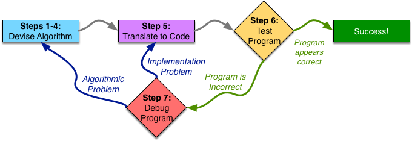
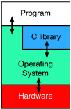

<h1 style="text-align: center; font-weight:bold;">
    Notes
</h1>

<br/>

# Programming Fundamentals

- ## Seven Step
    <div align = center>
        
    </div>
    <div align = center>
        
    </div>

- ## Everything Is a Number
    Decimal, Hex, and Binary

<br/><br/><br/>

# Writing, Running, and Fixing Code in C

- ## UNIX Basics
    Command:  
    `ls cd man mkdir rmkir`  
    `cat more less head tail`  
    `mv cp rm`
    `diff`  

    Globbing and Braces:  
    `?` `[...]` `[!...]`

- ## Emacs
    Search:  `C-s`  next `C-s`  return `C-r`  
    Redraw screen: `C-l`  
    Undo: `C-x u`  
    Move to beginning of line: `C-a`  
    Move to end of line: `C-e`  

    Set mark: `C-x space`  
    Cut to end of line: `C-k`  
    Cut: `C-w`  
    Copy: `M-w`  
    Paste: `C-y`  
    Complete current word: `M-/`  

    Start the keyboard macro: `C-x (`  
    Finish defining keyboard macro: `C-x )`  
    Repeat macro one time: `C-x e`  

    Open new windows: `C-x 2` `C-x 3`  
    Close window: `C-x 0`  
    Swith window: `C-x o`

- ## Compiling
    <div align = center>
        
    </div>

- ## Make
    ```
    CC = gcc
    CFLAGS = -std=gnu99 -pedantic -Wall -O3
    DBGFLAGS = -std=gnu99 -pedantic -Wall -ggdb3 -DDEBUG
    SRCS=$(wildcard *.c)
    OBJS=$(patsubst %.c,%.o,$(SRCS))
    DBGOBJS=$(patsubst %.c,%.dbg.o,$(SRCS))
    .PHONY: clean depend all
    all: myProgram myProgram-debug
    myProgram: $(OBJS)
        $(CC) -o $@ -O3 $(OBJS)
    myProgram-debug: $(DBGOBJS)
        $(CC) -o $@ -ggdb3 $(DBGOBJS)
    %.dbg.o: %.c
        $(CC) $(DBGFLAGS) -c -o $@ $<
    clean:
        rm -f myProgram myProgram-debug *.o *.c~ *.h~
    depend:
        makedepend $(SRCS)
        makedepend -a -o .dbg.o  $(SRCS)
    # DO NOT DELETE
    anotherFile.o: anotherHeader.h someHeader.h
    oneFile.o: oneHeader.h someHeader.h
    ```
    * Recommended warning options  
    `-Wall -Wsign-compare -Wwrite-strings -Wtype-limits -Werror`  

    * Parallelizing computation
        > One useful feature of make, especially on modern multi-core systems is the ability to have it run independent tasks in parallel. If you give make the -j option, it requests that it run as many tasks in parallel as it can. You may wish to ask it to limit the number of parallel tasks to a particular number at any given time, which you can do by specifying that number as an argument to the -j option (, make -j8 runs up to 8 tasks in parallel). On large projects, this may make a significant difference in how long a build takes.

- Testing  
    Black Box Testing  
    White Box Testing  

    Asserts 
    > you can pass the -DNDEBUG option to the compiler to turn off the asserts in your optimized code.

- gdb  
    Run gdb inside *emacs*: `M-x gdb`  

    Commands:  
    ```
    start  
    step  
    next  
    until  
    finish  

    print  
    display  

    backtrace  
    up  
    down  

    break  
    watch
    ```

<br/><br/><br/>

# Pointers, Arrays, and Recursion

- ## Arrays
    `void arr[n]` decays to `void *arr`.  
    Generally, `void arr[a][b]...[k]` decays to `void (*arr)[b]...[k]`.

- ## Strings
    String is a kind of an array.  
    `const char *s` 和 `char s[n]`  
    String literals are stored in the `static data section` and are immutable.

- ## Array of Pointers and Pointer to an Array
    Array of Pointers `void *arr[n]`  
    Pointer to an Array `void (*ptr)[n]`  
    When passed to a function, an n-dimensional array decays into a pointer to an (n−1)-dimensional array. Specifically, a 2D array decays into a pointer to its first row.

- ## Function Pointers
    Assue a function: `int f(int num);`  
    The function pointer define: `int (*ptr) int`  
    or: `typedef int (*f_ptr) int` to define `f_ptr ptr`

- Take care of `Dangling Pointers` `Buffer Overflow` and `Format String Attacks`.


- ## Recursion
  - ### Head Recursion
    ```
    recursion → stop condition
                    ↓
            ans ← return
    ```
  - ### Tail Recursion
    Replacing iteration with direct return of the result allows the compiler, with optimizations enabled, to reuse stack frames and reduce memory usage. This approach becomes effectively equivalent to iteration or tail recursion.
  - ### Mutual Recursion
    Mutual recursion between two functions.

<br/><br/><br/>

# Interacting with the System and Managing Memory

- ## Operating System
    <div align = center>
        
    </div>

- ## getline
    `ssize_t getline(char **lineptr, size_t *n, FILE *stream);`  
    POSIX.1-2008

- ## valgrind
    Memcheck is the default tool.  
    Run with `--vgdb=full --vgdb-error=0`, Valgrind will stop on the first error it encounters and give control to GDB.  
    `memcheck.h`  
    Other Valgrind Tools: `Helgrind` `Callgrind` `Massif`

- ## FILE
    Due to `#define EOF = -1`, take care of `while (char c = fgetc() != EOF)`  
    `stdin` `stdout` `stderr` (FILE *)

- ## Abstraction
  - Bottom-up: 
    >In a bottom-up design, you start with the smallest building blocks first, and build successively larger components from them. However, the downside is that you have to be sure that you are building the right blocks, and that they all fit together in the end.  
  - Top-down: 
    >In top-down, you start by designing the highest-level algorithm and determine what other functions you need in support of it. You then proceed to design these functions, until you reach small enough functions that you do not need to abstract out any more pieces. The downside to top-down design can arise in testing.

- ## Readability
  - Function Size
  - Naming
  - Formatting
  - Commenting and Documentation