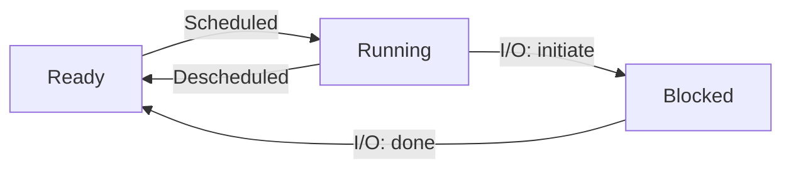

# 操作系统原理

## 绪论
### 操作系统定义
> Operating System: A body of software, in fact, that is responsible for making it easy to run programs (even allowing you to seemingly run many at the same time), allowing programs to share memory, enabling programs to interact with devices, and other fun stuff like that. (OSTEP)
### 发展历程
库函数批处理 -> 设备保护 -> 多程序调度 -> 资源虚拟化 -> 现代OS

### 软件视角
#### 最小程序 (JustForFun)
从`void _start()`开始，仅使用系统调用`write` `exit`实现 hello world 输出，并裁切多余节头，体积减少了将近90倍。
#### 系统调用指令：请求操作系统系统服务
syscall (x86-64), ecall (risc-v), svc (aarch64)\
只有它可以打破 “程序状态” (memory/register) 的边界
#### OS上的程序
- Applications
- Utilities
- Daemons
#### 操作系统中的任何程序
- 总是从被操作系统加载开始
    - 通过另一个进程执行 execve 设置为初始状态
- 经历状态机执行 (计算 + syscalls)
    - 进程管理：fork, execve, exit, …
    - 文件/设备管理：open, close, read, write, …
    - 存储管理：mmap, brk, …
- 最终调用 _exit (exit_group) 退出

操作系统 = 对象 + API

### 硬件视角
执行机器指令的状态机\
从 CPU Reset 开始执行，首先执行 **Firmware** 的代码
#### Firmware
厂商固定在计算机里的代码
- 完成硬件扫描，初始化和配置
- 不严格的说，加载操作系统

firmware 可以说就是一个小“操作系统”，初始化硬件，对接 Boot Loader

Legacy BIOS (Basic I/O System) -> UEFI (Unified Extensible Firmware Interface)

#### IBM PC/PC-DOS 2.0 (1983)
Firmware (BIOS) 会加载磁盘的前 512 字节到 0x7c00\
让我们试试：
```bash
(printf "\xeb\xfe"; cat /dev/zero | head -c 508; printf "\x55\xaa") > a.img
qemu-system-x86_64 a.img
```
qemu显示：Booting from Hard Disk.\
开头的`eb` `fe`是`jmp $-2`，跳转回自身，形成死循环\
结尾的`55` `aa`是 Boot Signature，表示这是一个合法的 Boot Sector

#### Grub 的例子
- Stage 1: 扫描磁盘，找到附近的 ELF 文件头，加载到内存
    - 根据文件系统，可能会需要 Stage 1.5
- Stage 2: 这个 ELF 文件是 Grub; 弹出熟悉的选择系统窗口
- Stage 3: 加载 Linux Kernel

## 虚拟化
### 程序与进程
先前的 Tower of Hanoi 的非递归版本，本质上是一个解释器，模拟了栈并解释执行。\
参照这样的思想，我们可以在程序里模拟任何 “另一个程序” 执行，这就是一个简单的操作系统。
#### 程序
程序是语义 (状态机) 的静态描述
- 描述了初始状态和迁移规则
- 程序运行起来，就成了进程 (进行中的状态机实例)
#### 进程
程序的运行时状态随时间的演进
##### 查询进程状态
- procfs
    - /proc/[pid]/
    - 通过 readdir, open, read 访问进程信息
- syscalls
    - getpid(), getppid(), getpgrp(), getsid(), getuid(), geteuid(), getgid(), getegid(), ……
##### 进程管理
操作系统 = 状态机的管理者\
进程管理 = 状态机管理
1. fork()
- 立即复制状态机，包括所有状态的完整拷贝，包括寄存器 & 每一个字节的内存
- Caveat: 进程在操作系统里也有状态: ppid, 文件, 信号, … （小心这些状态的复制行为）
- 复制失败返回 -1，errno 会返回错误原因
- 新创建进程返回 0，执行 fork 的进程返回子进程的进程号——“父子关系”

    进程树
    - 进程的创建关系形成了进程树
    - A → B → C，如果 B 终止了……C 的 ppid 是什么？
        - 子进程结束会通过 SIGCHLD 信号通知父进程
        - 孤儿进程由 init 进程接管
    ```bash
    # Fork Bomb
    :(){ :|:& };:
    ```
    应用
    - 共享信息预处理
        - fork 进程分段处理计算 prime_table
        - Android Zygote Process，完成 “冷启动”
    - 并行搜索
        - Depth-first search
    - 沙箱隔离
        - 定期做一个 checkpoint，如果程序 crash 了就从 checkpoint 恢复
    
    理解 fork
    - fork() 会完整复制状态机，包括尚未 flush 的 stdio 缓冲区
    - 接终端：stdout 是行缓冲
    - 接管道：stdout 变成全缓冲
2. execve()
    唯一能够 “执行程序” 的系统调用
    ```c
    int execve(const char *filename,
               char * const argv[], char * const envp[]);
    ```
    设置进程初始状态
    - argc & argv: 命令行参数
    - envp: 环境变量
    - 程序被正确加载到内存

    PATH 环境变量：可执行文件搜索路径
3. _exit()
    立即摧毁状态机，允许有一个返回值，可以被父进程获取
    ```c
    void _exit(int status);
    ```

    理解 exit
    - exit() 是 libc 库函数，会调用 exit_group()，并执行 atexit() 注册的函数
    - _exit() 也是 libc 库函数，会调用 exit_group()，但不会执行 atexit() 注册的函数
    - syscall(SYS_exit, ) 直接执行系统调用 exit() ，不会执行任何清理工作

#### 进程状态机

#### 重定向输出 >
当用 > 重定向输出时，shell 会创建一个子进程，关闭 stdout，打开一个文件描述符，指向文件，按照 Unix 总是分配最小的文件描述符的原则，这个文件描述符会被分配到 1，指向文件。

### 进程的地址空间
- 隔离与保护：不同进程的地址空间相互独立
- 便于管理与扩展：程序以为自己占有一大片连续内存 (实际按需分配)
- 支持共享在隔离的前提下，允许有限的共享

#### 进程 execve 后的进程地址空间
- ABI 中规定的 initial state (System V ABI)
    - Section 3.4: “Process Initialization”
    - 只规定了部分寄存器和栈 (argv 和 envp 中的字符串保存在栈中)
- Binary 中指定的 PT_LOAD 段
    - 内存是分成 “一段一段” 的
    - 每一段有访问权限 (rwx)

#### 地址空间管理 API
UNIX: brk/sbrk
> Note that you should never directly call either brk or sbrk. They
are used by the memory-allocation library; if you try to use them, you
will likely make something go (horribly) wrong.

Memory Map 系统调用
```c
// 映射
void *mmap(void *addr, size_t length, int prot, int flags,
           int fd, off_t offset);
int munmap(void *addr, size_t length);

// 修改映射权限
int mprotect(void *addr, size_t length, int prot);
```
- 瞬间完成内存分配，mmap/munmap 为 malloc/free 提供了机制
- 映射大文件、只访问其中的一小部分


所有和内存相关的功能，底层几乎都是 mmap
- 内存分配
    - 进程内的内存分配器会问操作系统要大内存
    - sbrk/brk 被保留，但操作系统内用 mmap 实现
    - 再切小了分配给 malloc()
- Memory-mapped I/O
    - /dev/gpiomem
- 进程间共享内存
    - shm_open() 可以返回一个文件，mmap 实现进程共享内存
- Just-in-time 生成代码
    - mprotect 可以改变 mmaped region 的权限 (rwx)

## 并发

## 持久化
