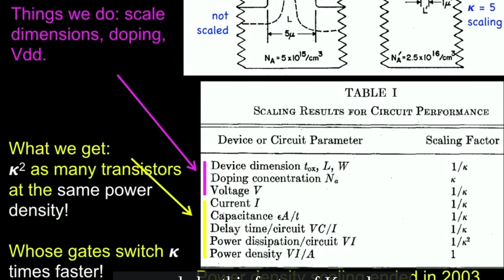
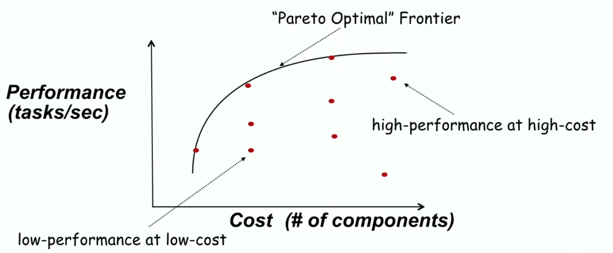
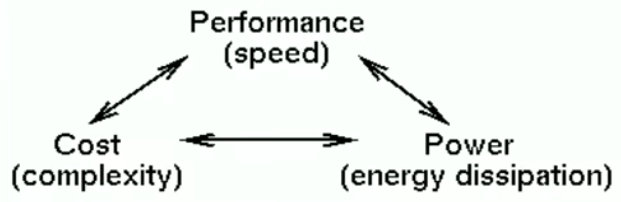
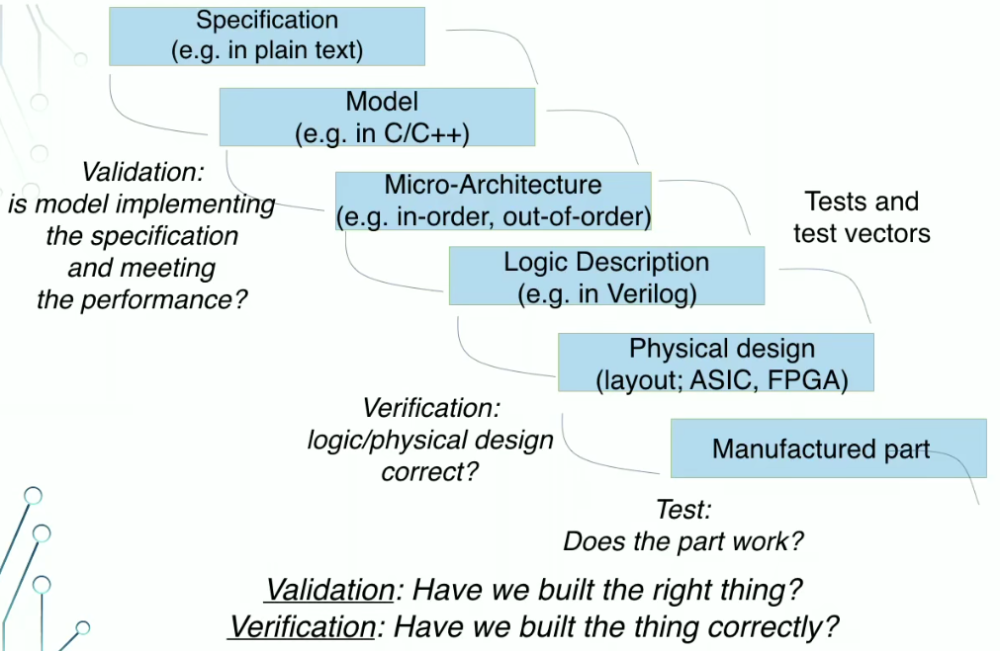
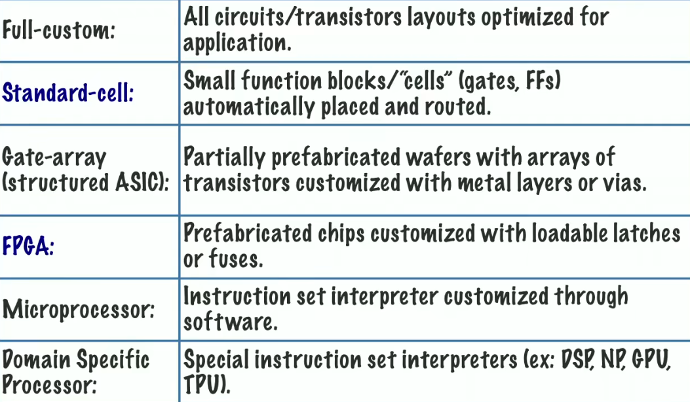
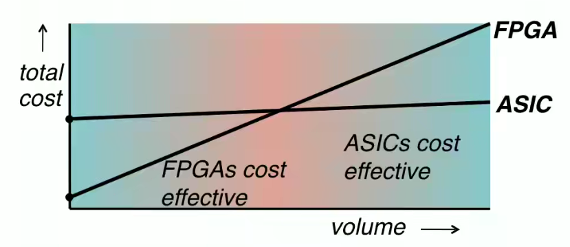

# EECS 151

## Intro
### Dennand Scaling
scale the gate length by a factor of k

this has ended a decade ago

### design space & optimality

### basic design tradeoff

all design decisions involve tradeoffs between performance, cost, and power

## Design
### implement digital systems
given a functional description and performance, cost and power constraints, come up with and implementation using a set of primitives
### design process

### performance
- throughput
- latency
### cost
cost per IC = variable cost per IC + $\frac{\text{fixed cost}}{\text{volume}}$

variable cost = $\frac{\text{cost of die}+\text{cost of die test}+\text{cost of packaging}}{\text{final test yield}}$

cost of die = $\frac{\text{cost of wafer}}{\text{dies per wafer}*\text{yield}}$
### yield
$\text{Y}=\frac{\text{No. of good chips per wafer}}{total no. of chips per wafer}$

$\text{die cost}=\frac{\text{wafer cost}}{\text{dies per wafer}*\text{die yield}}$

$\text{dies per wafer}=\frac{\pi (\text{wafer diameter}/2)^2}{\text{die area}}-\frac{\pi \cdot \text{wafer diameter}}{\sqrt{2\cdot \text{die area}}}$
### defects
$\text{die yield}=(1+\frac{\text{defects per unit area}\cdot \text{die area}}{\alpha})^{-\alpha}$\
$\alpha$ is approximately 3

die cost = $f(\text{die area})^4$

### restoration/regeneration

### implementation alternative

### FPGA vs ASIC
