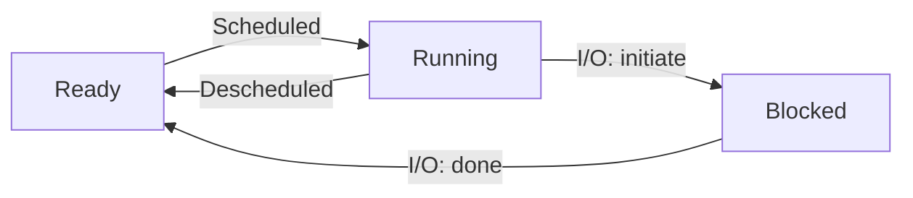

# 操作系统原理

## 绪论
### 操作系统定义
> Operating System: A body of software, in fact, that is responsible for making it easy to run programs (even allowing you to seemingly run many at the same time), allowing programs to share memory, enabling programs to interact with devices, and other fun stuff like that. (OSTEP)
### 发展历程
库函数批处理 -> 设备保护 -> 多程序调度 -> 资源虚拟化 -> 现代OS

### 软件视角
#### 最小程序 (JustForFun)
从`void _start()`开始，仅使用系统调用`write` `exit`实现 hello world 输出，并裁切多余节头，体积减少了将近90倍。
#### 系统调用指令：请求操作系统系统服务
syscall (x86-64), ecall (risc-v), svc (aarch64)\
只有它可以打破 “程序状态” (memory/register) 的边界
#### OS上的程序
- Applications
- Utilities
- Daemons
#### 操作系统中的任何程序
- 总是从被操作系统加载开始
    - 通过另一个进程执行 execve 设置为初始状态
- 经历状态机执行 (计算 + syscalls)
    - 进程管理：fork, execve, exit, …
    - 文件/设备管理：open, close, read, write, …
    - 存储管理：mmap, brk, …
- 最终调用 _exit (exit_group) 退出

操作系统 = 对象 + API

### 硬件视角
执行机器指令的状态机\
从 CPU Reset 开始执行，首先执行 **Firmware** 的代码
#### Firmware
厂商固定在计算机里的代码
- 完成硬件扫描，初始化和配置
- 不严格的说，加载操作系统

firmware 可以说就是一个小“操作系统”，初始化硬件，对接 Boot Loader

Legacy BIOS (Basic I/O System) -> UEFI (Unified Extensible Firmware Interface)

#### IBM PC/PC-DOS 2.0 (1983)
Firmware (BIOS) 会加载磁盘的前 512 字节到 0x7c00\
让我们试试：
```bash
(printf "\xeb\xfe"; cat /dev/zero | head -c 508; printf "\x55\xaa") > a.img
qemu-system-x86_64 a.img
```
qemu显示：Booting from Hard Disk.\
开头的`eb` `fe`是`jmp $-2`，跳转回自身，形成死循环\
结尾的`55` `aa`是 Boot Signature，表示这是一个合法的 Boot Sector

#### Grub 的例子
- Stage 1: 扫描磁盘，找到附近的 ELF 文件头，加载到内存
    - 根据文件系统，可能会需要 Stage 1.5
- Stage 2: 这个 ELF 文件是 Grub; 弹出熟悉的选择系统窗口
- Stage 3: 加载 Linux Kernel

## 虚拟化
### 程序与进程
先前的 Tower of Hanoi 的非递归版本，本质上是一个解释器，模拟了栈并解释执行。\
参照这样的思想，我们可以在程序里模拟任何 “另一个程序” 执行，这就是一个简单的操作系统。
#### 程序
程序是语义 (状态机) 的静态描述
- 描述了初始状态和迁移规则
- 程序运行起来，就成了进程 (进行中的状态机实例)
#### 进程
程序的运行时状态随时间的演进
##### 查询进程状态
- procfs
    - /proc/[pid]/
    - 通过 readdir, open, read 访问进程信息
- syscalls
    - getpid(), getppid(), getpgrp(), getsid(), getuid(), geteuid(), getgid(), getegid(), ……
##### 进程管理
操作系统 = 状态机的管理者\
进程管理 = 状态机管理
1. fork()
- 立即复制状态机，包括所有状态的完整拷贝，包括寄存器 & 每一个字节的内存
- Caveat: 进程在操作系统里也有状态: ppid, 文件, 信号, … （小心这些状态的复制行为）
- 复制失败返回 -1，errno 会返回错误原因
- 新创建进程返回 0，执行 fork 的进程返回子进程的进程号——“父子关系”

    进程树
    - 进程的创建关系形成了进程树
    - A → B → C，如果 B 终止了……C 的 ppid 是什么？
        - 子进程结束会通过 SIGCHLD 信号通知父进程
        - 孤儿进程由 init 进程接管
    ```bash
    # Fork Bomb
    :(){ :|:& };:
    ```
    应用
    - 共享信息预处理
        - fork 进程分段处理计算 prime_table
        - Android Zygote Process，完成 “冷启动”
    - 并行搜索
        - Depth-first search
    - 沙箱隔离
        - 定期做一个 checkpoint，如果程序 crash 了就从 checkpoint 恢复
    
    理解 fork
    - fork() 会完整复制状态机，包括尚未 flush 的 stdio 缓冲区
    - 接终端：stdout 是行缓冲
    - 接管道：stdout 变成全缓冲
2. execve()
    唯一能够 “执行程序” 的系统调用
    ```c
    int execve(const char *filename,
               char * const argv[], char * const envp[]);
    ```
    设置进程初始状态
    - argc & argv: 命令行参数
    - envp: 环境变量
    - 程序被正确加载到内存

    PATH 环境变量：可执行文件搜索路径
3. _exit()
    立即摧毁状态机，允许有一个返回值，可以被父进程获取
    ```c
    void _exit(int status);
    ```

    理解 exit
    - exit() 是 libc 库函数，会调用 exit_group()，并执行 atexit() 注册的函数
    - _exit() 也是 libc 库函数，会调用 exit_group()，但不会执行 atexit() 注册的函数
    - syscall(SYS_exit, ) 直接执行系统调用 exit() ，不会执行任何清理工作

#### 进程状态机

```mermaid
graph LR
    Ready -- Scheduled --> Running
    Running -- "I/O: initiate" --> Blocked
    Running -- Descheduled --> Ready
    Blocked -- "I/O: done" --> Ready
```
#### 重定向输出 >
当用 > 重定向输出时，shell 会创建一个子进程，关闭 stdout，打开一个文件描述符，指向文件，按照 Unix 总是分配最小的文件描述符的原则，这个文件描述符会被分配到 1，指向文件。

### 进程的地址空间
- 隔离与保护：不同进程的地址空间相互独立
- 便于管理与扩展：程序以为自己占有一大片连续内存 (实际按需分配)
- 支持共享在隔离的前提下，允许有限的共享

#### 进程 execve 后的进程地址空间
- ABI 中规定的 initial state (System V ABI)
    - Section 3.4: “Process Initialization”
    - 只规定了部分寄存器和栈 (argv 和 envp 中的字符串保存在栈中)
- Binary 中指定的 PT_LOAD 段
    - 内存是分成 “一段一段” 的
    - 每一段有访问权限 (rwx)

#### 地址空间管理 API
UNIX: brk/sbrk
> Note that you should never directly call either brk or sbrk. They
are used by the memory-allocation library; if you try to use them, you
will likely make something go (horribly) wrong.

Memory Map 系统调用
```c
// 映射
void *mmap(void *addr, size_t length, int prot, int flags,
           int fd, off_t offset);
int munmap(void *addr, size_t length);

// 修改映射权限
int mprotect(void *addr, size_t length, int prot);
```
- 瞬间完成内存分配，mmap/munmap 为 malloc/free 提供了机制
- 映射大文件、只访问其中的一小部分


所有和内存相关的功能，底层几乎都是 mmap
- 内存分配
    - 进程内的内存分配器会问操作系统要大内存
    - sbrk/brk 被保留，但操作系统内用 mmap 实现
    - 再切小了分配给 malloc()
- Memory-mapped I/O
    - /dev/gpiomem
- 进程间共享内存
    - shm_open() 可以返回一个文件，mmap 实现进程共享内存
- Just-in-time 生成代码
    - mprotect 可以改变 mmaped region 的权限 (rwx)

### 操作系统对象
读取网络请求、写入文件、和其他进程通信都是访问操作系统对象\
操作系统设计是为了满足程序员的需求，提供一套简单、稳定的通用 API

#### UNIX: Everything is a file
一个普适的抽象\
任何数据流/数组都可以抽象为**文件**，用目录来管理名字

FHS (Filesystem Hierarchy Standard) 规定了 Linux 系统的目录结构

Keep It Simple, Stupid (KISS)

#### 文件描述符：访问操作系统对象的“指针”
- 0: stdin, 1: stdout, 2: stderr, ...
- open() 总是分配最小的未使用的描述符

#### 复杂性
API 直接会相互影响
- fork() 会复制文件描述符表
- 实际上会导致系统设计复杂化

Windows Handle API
- 默认 handle 不继承
- “最小权限原则”

#### 管道
mkfifo 创建一个 FIFO 文件，两个进程可以通过它通信\
int pipe(int fildes[2]); 创建一个仅进程内部可见的管道

### C 标准库
构建应用生态：组合、复用、分层
#### 标准化
- ISO C, 稳定可靠，移植性
- POSIX C 的子集 (unistd.h, ...)
- 有些标准库功能依赖操作系统 (putchar, exit)
- Freestanding: 不依赖任何 Host OS 功能
#### 机器/平台相关
- stddef.h, float.h, limits.h, inttypes.h, stdint.h
- offsetof(T, m): 结构体成员 m 在结构体 T 中的偏移量
- PRIdPTR, PRIuPTR: 可移植的 printf 格式化输出
#### ABI 相关的参数解析
- stdarg.h
    - 寄存器传参，栈传参，实现复杂
#### 库函数
- string.h: memcpy, memmove, strcpy, ...
- stdlib.h: rand, atoi, qsort, ...
- math.h
#### error
- perror: 打印 errno 对应的错误信息，有语言本地化
#### Debug Info
- 可以用 .symtab 做调试信息
- gcc -gstabs 生成 .stab 符号表，gdb 可以用它调试
- DWARF：bytecode 指令集，图灵完备，也可用于实现 C++ 异常的 stack unwinding
- trace/profiler
- crash dump
- AddressSanitizer 诊断报告
#### 可变参数
- stdarg.h
- C 语言的可变参数是通过栈实现的，编译器会在函数调用时把参数压入栈中，函数内部通过 va_list、va_start、va_arg、va_end 等宏来访问这些参数。
#### setjmp/longjmp
- setjmp 用于保存当前的执行环境（包括寄存器状态、栈指针等）
- longjmp 用于跳转回之前保存的执行环境，并恢复到那个状态
- 程序是一个状态机
#### gettimeofday
没有使用系统调用，而是进入 vDSO, 这是一个内核提供的共享库，允许用户空间直接访问一些内核功能，从而避免了系统调用的开销。
#### malloc/free
- 操作系统本身不支持分配一小段内存
- 本质是 mmap/sbrk 的封装
- 对于小内存分配，虚拟内存会用 brk/sbrk 分配堆区（低地址）；对于大内存分配，会直接 mmap 分配内存映射区域（高地址）。malloc 分配堆区的说法其实是不准确的
- 越小的对象，创建/分配越频繁

> Premature optimization is the root of all evil.\
> ——D. E. Knuth

#### malloc, Fast and Slow
- Fast path (System I)
    - 性能极好、覆盖大部分情况
    - 但有小概率会失败 (fall back to slow path)
- Slow path (System II)
    - 不在乎那么快
    - 但把困难的事情做好
#### 空间换简洁
- 分配: Segregated Lists
    - 每个 slab 里的每个对象都一样大
    - fast path → 立即在线程本地分配完成
    - slow path → mmap()
- 回收: O(1)

### 链接和加载
#### 静态链接
UNIX a.out "assembler output"
```c
struct exec {
    uint32_t  a_midmag;  // Machine ID & Magic
    uint32_t  a_text;    // Text segment size
    uint32_t  a_data;    // Data segment size
    uint32_t  a_bss;     // BSS segment size
    uint32_t  a_syms;    // Symbol table size
    uint32_t  a_entry;   // Entry point
    uint32_t  a_trsize;  // Text reloc table size
    uint32_t  a_drsize;  // Data reloc table size
};
```
- 没有 offset
- 不支持动态链接、调试信息、内存对齐、thread-local ...
#### Linux 加载器
execve() 会调用内核的加载器，加载 ELF 文件到内存中，并设置进程的初始状态

Shebang (#!) 是 Linux 加载器的一个特性，允许脚本文件指定解释器。例如，`#!/bin/bash` 表示该脚本应由 Bash 解释器执行。
- POSIX 定义缺陷：解释器参数是作为一个整体传递的，在其他平台上可能会被拆分成多个参数，导致兼容性问题
- Linux 优先使用 #! 作为解释器，再解析 ELF
#### 动态链接
- 动态链接器 (Dynamic Linker) 负责在程序运行时加载共享库
- 多个程序可以共享同一个共享库的代码段，从而节省内存
- 动态链接库是位置无关代码
- 程序的第一条指令是 _dlstart，负责调用动态链接器，加载共享库，并解析符号表，再跳转到 _start
- 'ld-linux.so' 硬编码在 ELF 文件的 INTERP 中
- glibc 是用 ld-linux.so 调用 mmap 加载共享库的
#### man 8 ld.so
- LD_LIBRARY_PATH: 指定共享库搜索路径
- LD_DEBUG=libs; ldd
- LD_BIND_NOW
- LD_SHOW_AUXV
- LD_PRELOAD
    - ld.so: 谁先被加载并首次满足未定义符号，谁就被调用
    - 可以用来替换系统调用的实现，或者在程序启动时注入自定义的库函数
#### 共享库的地址
- 编译/链接时候地址是未知的，但是跳转/访存指令需要一个确定的地址
- 函数调用跳转到 PLT (Procedure Linkage Table) 的入口，PLT 里有一个跳转到 GOT (Global Offset Table) 的指令，GOT 里存放了函数的实际地址
- 全局变量访问也是通过 GOT 来实现的，GOT 里存放了全局变量的实际地址

#### 第一个进程
- Linux 内核启动后，会执行 execeve 启动第一个进程，但是执行 execve 需要文件系统的路径
- 初始状态，会加载 initramfs (initial RAM filesystem)，这是一个临时的根文件系统，包含了启动所需的最小文件和程序
    - 加载必要的驱动程序
    - 挂载必要的根文件系统
    - 将根文件系统和控制权转移给另一个程序
- `int pivot_root(const char *new_root, const char *put_old);`\
切换到新的根文件系统 new_root，并将旧的根文件系统挂载到 put_old 目录下
- 然后执行 `/sbin/init`，这是第一个用户空间进程，负责启动系统的其他进程和服务，在现代 Linux 系统中，通常是 systemd

### 应用生态
应用生态成就了操作系统的繁荣
#### Debian 包管理
deb 包是一个 tar 压缩包，里面包含了程序的二进制文件、配置文件、依赖关系等信息。
- control.tar.xz
    - control 文件：包含包的元数据，如包名、版本、依赖关系等
- data.tar.xz
    - 实际的文件
- Preinstall & Unpack → Configure → Triggers → Postinstall

## 并发
### 多处理器编程
#### motivation
- syscall 执行期间，CPU 可能会被阻塞，导致 CPU 空闲
- 多处理器系统共享内存
#### 并发 & 并行
- 并发 (Concurrency): 多个任务在同一时间段内交替执行
- 并行 (Parallelism): 多个任务在同一时间点上同时执行
#### 困难
- 不确定性 (Non-determinism): 由于任务的执行顺序不确定，可能会导致不同的结果
- 非顺序性 (Out-of-order)
    - 编译器优化: 编译器可能会对代码进行优化，改变指令的顺序，导致程序的执行顺序与代码顺序不一致
    - CPU 指令乱序执行: CPU 为了提高性能，可能会对指令进行乱序执行，导致程序的执行顺序与代码顺序不一致 (处理器也可以看作是编译器)
- 宽松内存模型 (Weak Memory Model): 不同的 CPU 核心可能会有不同的缓存，导致不同核心看到的内存状态不一致
    - store 写入 cache，再同步给其他核心，可能会有延迟
    - 允许 load 读到 cache 中的旧值，导致不同核心看到的内存状态不一致

> 在某种意义上，编程语言的内存模型比最宽松的硬件内存模型弱，因为编译器优化可能会改变代码的执行顺序，导致程序的执行顺序与代码顺序不一致。----Russ Cox
#### 控制编译器优化
- 插入不可优化的内存屏障 (Memory Barrier)
    ```c
    asm volatile("" ::: "memory");
    ```
- 标记变量 load/store 为 volatile，禁止编译器优化
    ```c
    volatile int x;
    ```
### 并发控制：互斥
操作系统的系统调用是共享内存的，因此需要并发控制
#### 单处理器系统：关闭中断
关闭中断处理使当前代码无法被中断，从而保证了当前代码的原子性。\
缺点：关闭中断会导致系统无法响应其他中断
#### 多处理器系统：锁
- 互斥锁 (Mutex): 通过阻塞的方式获取锁
    - lock (acquire): 有 🔑，就拿走继续；没有 🔑，需要等待
    - unlock (release): 把 🔑 放回桌上
- 自旋锁 (Spinlock): 通过忙等待的方式获取锁
    - __atomic_exchange_n()
#### “一把大锁保平安”
Linux 内核早期使用 Big Kernel Lock (BKL) 来保护整个内核的并发访问，后来逐渐被细粒度锁取代，以提高并发性能
#### 线程的必要性
- 悲观的 Amdahl’s Law
    - 如果你有 1/k 的代码是不能并行的，那么 $$T_∞ > \frac{T_1}{k}$$
- 乐观的 Gustafson’s Law
    - 能并行的并行计算总是能实现的 $$T_p < T_∞ + \frac{T_1}{p}$$
- 局部性原理 (Locality Principle)
#### Dekker’s algorithm
A process P can enter the critical section if the other does not want to enter, otherwise it may enter only if it is its turn.
```
status[i] = competing;
while status[other] == competing do
    if turn == other then
        status[i] = out;
        wait until turn == i;
        status[i] = competing;
    end if
end while
// 临界区
turn = other;
status[i] = out;
```
#### Peterson’s Algorithm
A process P can enter the critical section if the other does not want to enter, or it has indicated its desire to enter and has given the other process the turn.
```
flag[i] = true;
turn = j;
while (flag[j] && turn == j);
// 临界区
flag[i] = false;
```
#### Peterson 算法的实现
假设
- Load/store 指令是瞬间完成且生效的
- 指令按照程序书写顺序执行

但是，现代 CPU 不满足这些假设，实际上是错误的

解决方法
- Compiler barrier (编译优化屏障)
    - asm volatile(“”: : :”memory”); 或是 volatile 变量
- Memory barrier (内存屏障)
    - x86: mfence
    - ARM: dmb ish
    - RISC-V: fence rw, rw
- __sync_synchronize() = Memory barrier + Compiler barrier
- **实现硬件原子操作**
    - x86: Bus Lock (locked instruction)
    - RISC-V: LR/SC & A 扩展
    - arm: ldxr/stxr, stadd (store add) 指令
#### 自旋锁：性能问题
- 除了获得锁的线程，其他处理器上的线程都在空转
- 应用程序不能关中断，持有自旋锁的线程被切换导致 100% 的资源浪费

#### 操作系统实现锁
- syscall(SYSCALL_acquire, &lk);
    - 试图获得 lk，但如果失败，就切换到其他线程
- syscall(SYSCALL_release, &lk);
    - 释放 lk，如果有等待锁的线程就唤醒
- 剩下的都是内核工作
    - 关中断 + 自旋 （自旋锁只用来保护操作系统中非常短的代码块）
    - 成功获得锁 → 返回
    - 获得失败 → 设置线程为“不可执行”并切换

##### 系统调用：futex
- fast (user-space only) & slow (kernel) path

性能的衡量在于定量研究
#### 并发数据结构
- approximate counter
- concurrent linked list
- concurrent hash table
- concurrent queue

### 并发控制：同步
达到一个全局的一致状态，保证数据的正确性\
确立 Happens-Before 关系，保证数据的可见性
#### 条件变量
- cond_wait: 释放锁，同时立即等待 (原子操作，否则会出现丢失唤醒)
- cond_wait 等待的线程，通过 signal(&cv) 或 broadcast(&cv) 唤醒
```c
// 线程 1
mutex_lock(&lk);
// 修改可能使 sync_cond() 成立的共享状态
cond_broadcast(&cv);    // 唤醒等待的线程
mutex_unlock(&lk);  // Release

// 线程 2
mutex_lock(&lk);  // Acquire
while (!sync_cond()) {    // 条件不成立时进入等待
    cond_wait(&cv, &lk);  // 等待并自动释放 lk, 被唤醒时重新获得 lk
}
// ... 执行后续操作
mutex_unlock(&lk);
```
关键：理解同步的条件
#### 生产者-消费者问题
99% 的实际并发问题都可以用生产者-消费者解决
- Master-slave (scheduler–worker) 模式

Producer 和 Consumer 共享一个缓冲区
- Producer (生产数据)：如果缓冲区有空位，放入；否则等待
- Consumer (消费数据)：如果缓冲区有数据，取走；否则等待
- 同步：同一个 object 的生产必须 happens-before 消费
#### 计算图模型
G(V, E): 有向无环的 Dependency Graph
- 计算任务在节点上
- 边 (u, v) 表示 v 的计算要用到 u 产生的值

这是一个非常基础的模型，几乎总是可以用这个视角去理解并行计算\
如果节点 “独立计算时间” 足够长，算法就是可高效并行的\
计算图也可以是动态的，一边计算，一边产生新的节点

实现
- 先进行拓扑排序，再按每一层的顺序执行
- 同步
    - 为每个计算节点设置一个线程和条件变量 (资源浪费)
    - 实现一个任务的调度器 (Executor Pool)

同步条件
- 为每个计算节点分配线程
    - 对于 u → v，T_u: 完成后为 T_v 生产一份；T_v: 消费 n_predecessors 份后才能继续
    - T_worker: 生产 ready，消费 job；T_scheduler: 消费 ready，生产 job

#### 信号量
pthread_mutex 不允许跨线程使用

## 持久化
