# CS61C notes
## Intro
### great ideas in computer architecture
- abstraction
- Moore's Law
- principle of locality/memory hierarchy
- parallelism
- performance measurement & improvement
- dependability via redundancy

## Number Representation
### signed integers
- sign and magnitude  
- one's complement  
- two's complement & bias encoding

## Floating Point
### IEEE Standard 754
$(-1)^S\times (1+\text{Significand}\times 2^{\text{Exponent}-\text{bias}})$

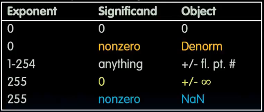

association and rounding

## RISC-V (RV32)
32 registers: x0 - x31  
x0 always holds value zero

### instructions
```asm
add x1, x2, x3
sub x1, x2, x3
addi x1, x2, imm

lw sw
lb sb
lbu

beq reg1, reg2, L1
bne blt bge
bltu bgeu

and x5, x6, x7
andi x5, x6, 2
xor

slli x11, x12, 2
sll srl sra srai

jal jalr
```

### calling convention
a0-a7 for argument registers(x10-x17) for function calls  
8 argument registers to pass parameters and 2 return values(a0-a1)

ra: one return address register to return to the point of origin(x1)

`sp` is the stack pointer(x2)

### caller & callee
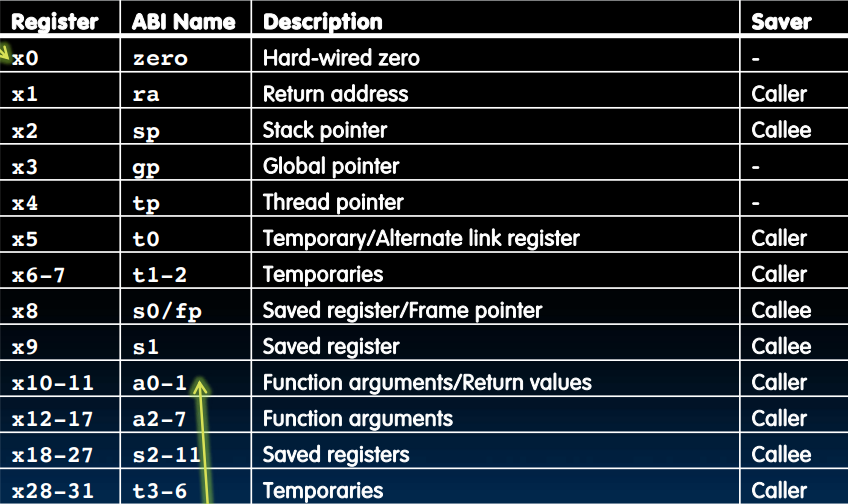

### Memory Management
stack starts in 0xbffffff0  
stack must be aligned on 16-byte boundary  
RV32 programs(text segment) in low end(0x00010000)  
static data segment above text for static variables  
use global pointer`gp` to point to static  
RV32 `gq` = 0x10000000  
heap above static

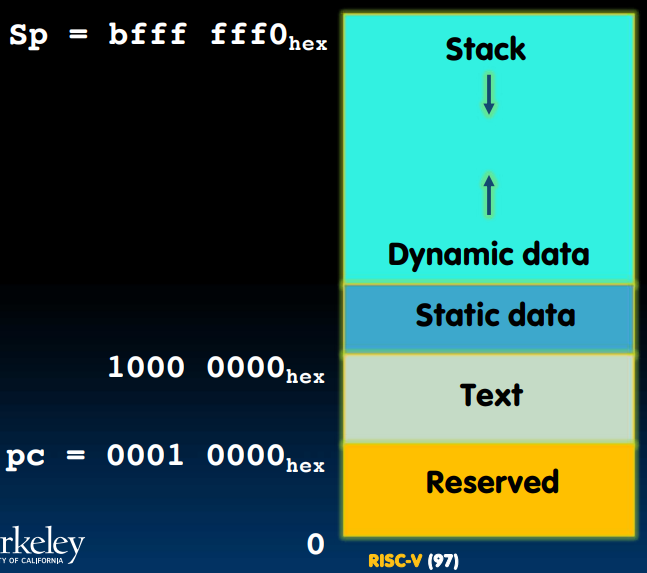

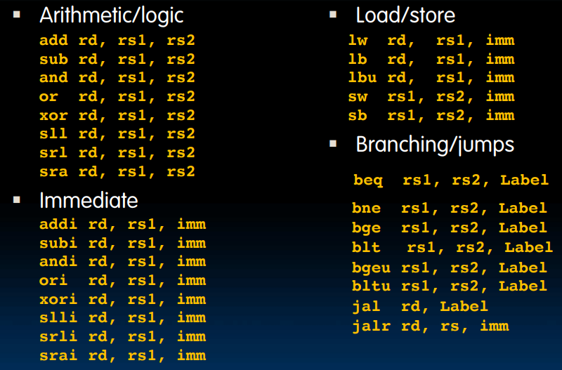

6 basic types of instruction formats
- R-type  
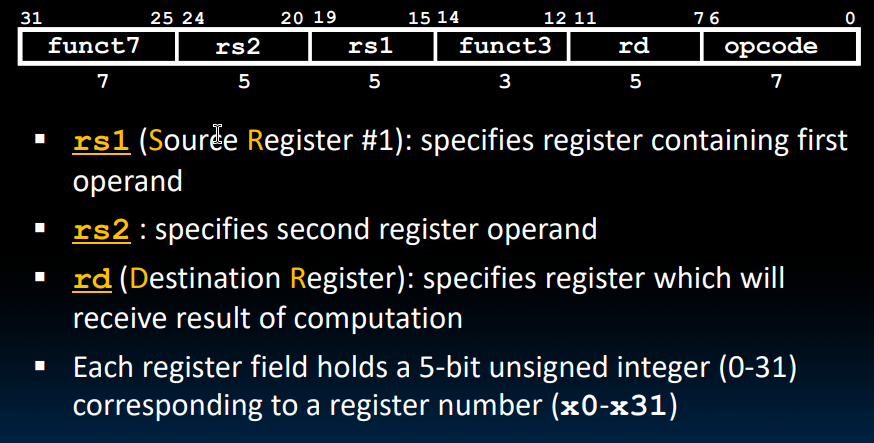
- I-type  
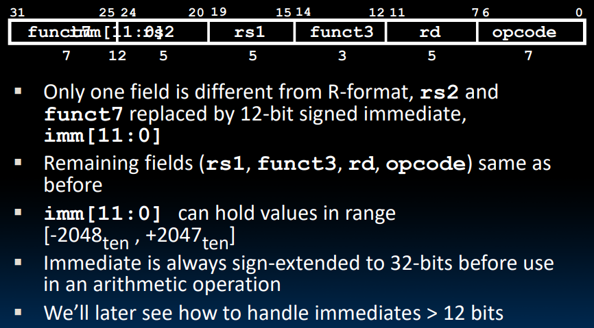
- S-type  
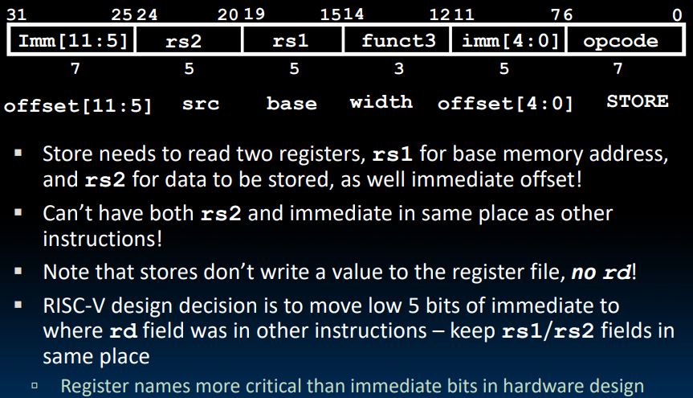
- B-type  
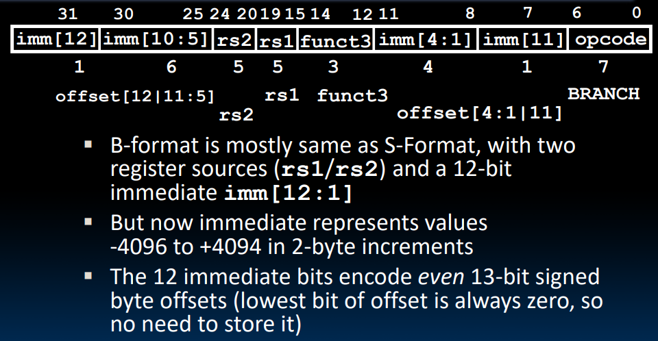
- U-type  
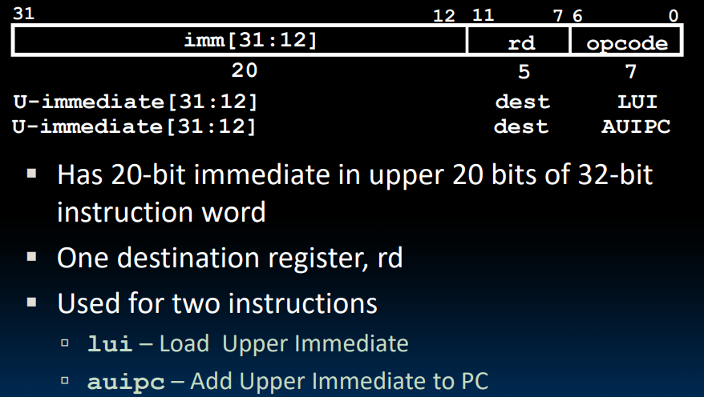
- J-type  
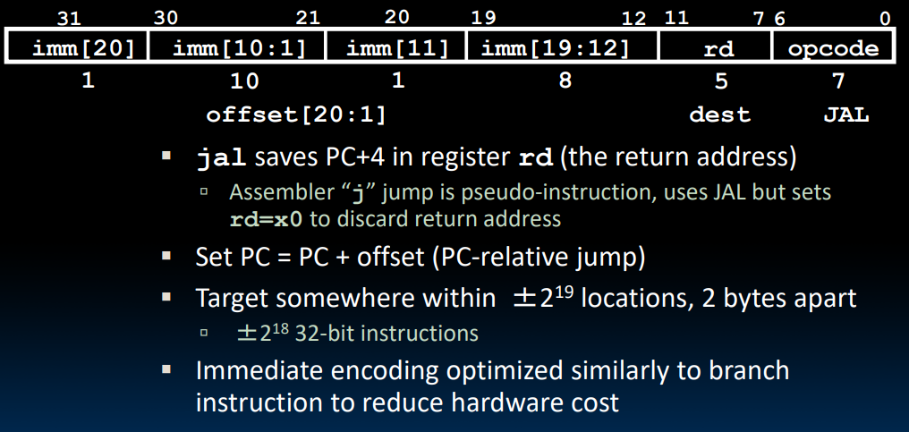

PC-relative addressing

### compressed instructions
ISA support 16-bit compressed instructions  
to enable this, RISCV scales the branch offset by 2 bytes

### special instructions
`LUI` writes the upper 20 bits to the destination with the immediate value. it can be used to load a 32-bit constant into a register.  
`AUIPC` adds the PC to the immediate value and places result in destination register.

## Compiling, Assembling, Linking, and Loading
### assembler directives
- `.text`: Subsequent items put in user text segment (machine code)
- `.data`: Subsequent items put in user data segment (source file data in binary)
- `.globl sym`: Declares sym global and can be referenced from other files
- `.string str`: Store the string str in memory and null-terminate it
- `.word w1…wn`: Store the n 32-bit quantities in successive memory words

### pseudo-instructions
```asm
# pseudo-instruction replacement
nop                 addi x0, x0, 0
mv t0, t1           addi t0, t1, 0
neg t0, t1          sub t0, zero, t1
li t0, imm          addi t0, zero, imm
li t0, t1           addi t0, zero, t1
not t0, t1          xor t0, t1, -1
beqz t0, loop       beq t0, zero, loop
la t0, str          lui t0, str[31:12]
                    addi t0, t0, str[11:0] or
                    auipc t0, str[31:12]
                    addi t0, t0, str[11:0]
j Label
```

## Synchronous Digital System
maximum clock frequency  
max delay = CLK-to-Q delay + CL delay + setup time

## Single-Cycle CPU Control
### CSRs
control and status registers(CSRs) are separate from the register file(x0-x31)  
not in the base ISA, but almost all RISC-V implementations have them  
there can be up to 4096 CSRs

the `CSRRW` is atomic read and write CSR

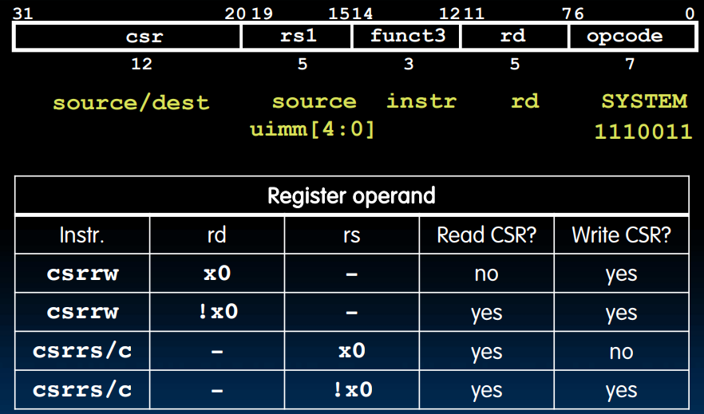
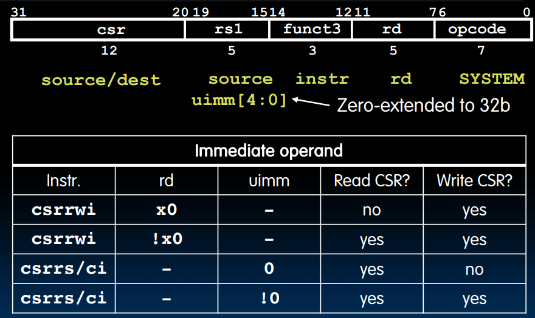

```asm
# pseudo-instruction
csrw csr, rs1 = csrrw x0, csr, rs1
csrwi csr, uimm = csrrwi x0, csr, uimm
```

### system instructions
- `ecall`: make requests to OS, such as system calls
- `ebreak`: used by debuggers to transfer control to the debugger
- `fence`: sequences memory and I/O accesses as viewed by other threads or co-processors

## Pipelining
### Performance Measurement
- instruction timing
- progamm execution time
- throughput
- energy per task  
> [!note]
> power is not a good measure, because it is not always related to performance

Iron Law:
$\frac{\text{time}}{\text{program}}=\frac{\text{instructions}}{\text{program}}\cdot \frac{\text{cycles}}{\text{instruction}}\cdot \frac{\text{time}}{\text{cycle}}$

CPI(Cycles Per Instruction):
$\frac{\text{cycles}}{\text{instruction}}$

#### instructions per program detemined by
- task
- algorithm
- programming language
- compiler
- instruction set architecture

#### CPI detemined by
- ISA
- processor implementation
- complex instructions
- superscalar processors

#### time per cycle determined by
- processor microachitecture
- technology
- power budget

### Energy Efficiency
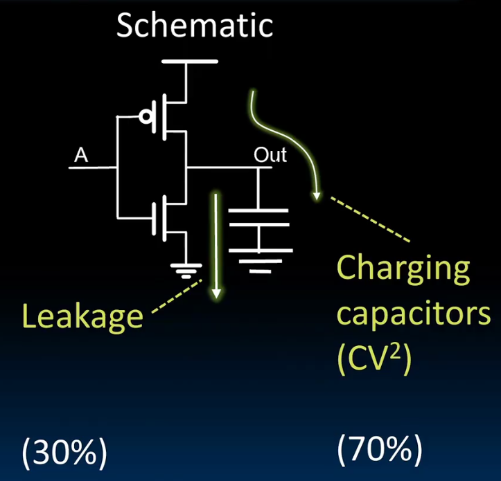

energy per task:
$\frac{\text{energy}}{\text{program}}=\frac{\text{instructions}}{\text{program}}\cdot \frac{\text{energy}}{\text{instruction}}=\frac{\text{instructions}}{\text{program}}\cdot CV^2$

Iron Law:
$\text{performance}=\text{power}\cdot \text{energy efficiency}$

### Pipelining
#### pipelining stages
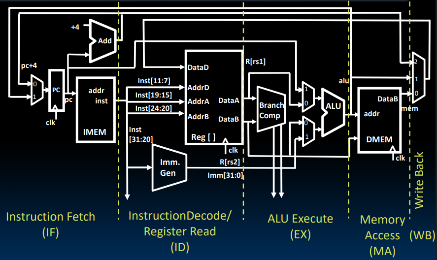
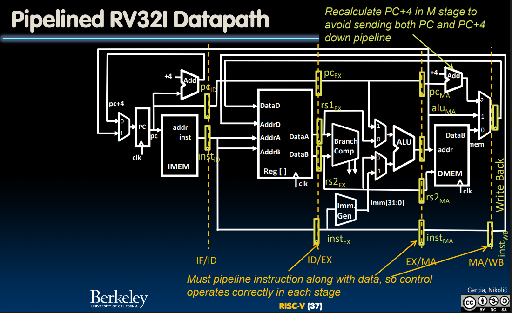

#### control logic:
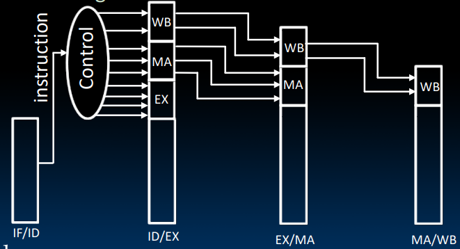

#### Hazards
1. structural hazard: a required resource is busy
   - stall
   - add more hardware
2. data hazard: data dependencies between instructions
   - stall
   - forwarding
   - code scheduling: reorder instructions to avoid data hazards

3. control hazard: flow of execution depends on previous instruction  
   for branch:
   - stall for 2 cycles
   - use branch prediction and flush pipeline

### Superscalar Processors
#### increasing processor performance
1. clock rate
   - limited by technology
2. pipelining
   - more potential for hazards
3. superscalar
   - multiple EXUs
   - generally with out of order execution

#### superscalar architecture
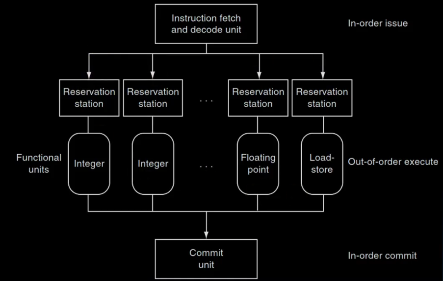

## Cache
