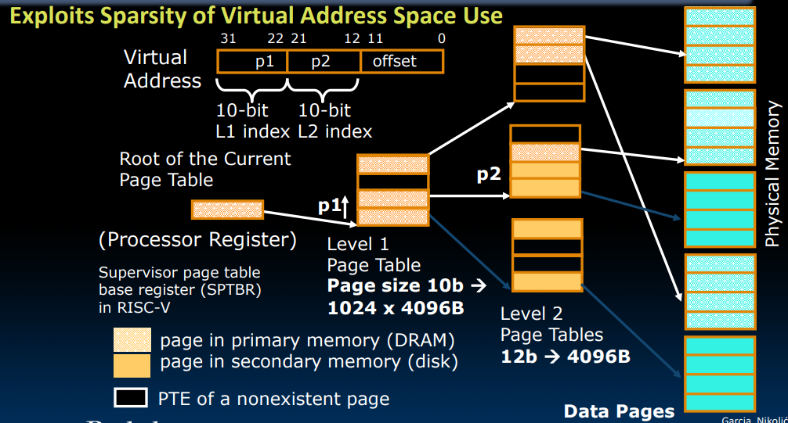
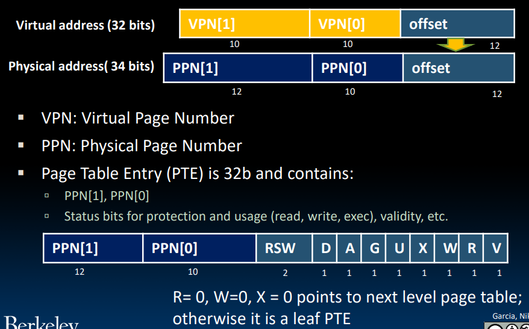
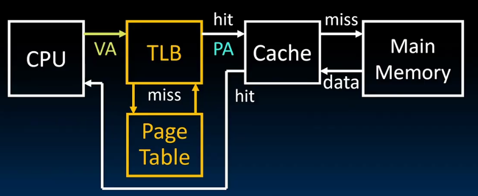

# CS61C notes
## Intro
### great ideas in computer architecture
- abstraction
- Moore's Law
- principle of locality/memory hierarchy
- parallelism
- performance measurement & improvement
- dependability via redundancy

## Number Representation
### signed integers
- sign and magnitude
- one's complement
- two's complement & bias encoding

## Floating Point
### IEEE Standard 754
$(-1)^S\times (1+\text{Significand}\times 2^{\text{Exponent}-\text{bias}})$


association and rounding

## RISC-V (RV32)
32 registers: x0 - x31
x0 always holds value zero

### instructions
```asm
add x1, x2, x3
sub x1, x2, x3
addi x1, x2, imm

lw sw
lb sb
lbu

beq reg1, reg2, L1
bne blt bge
bltu bgeu

and x5, x6, x7
andi x5, x6, 2
xor

slli x11, x12, 2
sll srl sra srai

jal jalr
```

### calling convention
a0-a7 for argument registers(x10-x17) for function calls\
8 argument registers to pass parameters and 2 return values(a0-a1)

ra: one return address register to return to the point of origin(x1)

`sp` is the stack pointer(x2)

### caller & callee


### Memory Management
stack starts in 0xbffffff0\
stack must be aligned on 16-byte boundary\
RV32 programs(text segment) in low end(0x00010000)\
static data segment above text for static variables\
use global pointer`gp` to point to static\
RV32 `gq` = 0x10000000\
heap above static


6 basic types of instruction formats
- R-type\

- I-type\

- S-type\

- B-type\

- U-type\

- J-type\


PC-relative addressing

### compressed instructions
ISA support 16-bit compressed instructions\
to enable this, RISCV scales the branch offset by 2 bytes

### special instructions
`LUI` writes the upper 20 bits to the destination with the immediate value. it can be used to load a 32-bit constant into a register.\
`AUIPC` adds the PC to the immediate value and places result in destination register.

## Compiling, Assembling, Linking, and Loading
### assembler directives
- `.text`: Subsequent items put in user text segment (machine code)
- `.data`: Subsequent items put in user data segment (source file data in binary)
- `.globl sym`: Declares sym global and can be referenced from other files
- `.string str`: Store the string str in memory and null-terminate it
- `.word w1…wn`: Store the n 32-bit quantities in successive memory words

### pseudo-instructions
```asm
# pseudo-instruction replacement
nop                 addi x0, x0, 0
mv t0, t1           addi t0, t1, 0
neg t0, t1          sub t0, zero, t1
li t0, imm          addi t0, zero, imm
li t0, t1           addi t0, zero, t1
not t0, t1          xor t0, t1, -1
beqz t0, loop       beq t0, zero, loop
la t0, str          lui t0, str[31:12]
                    addi t0, t0, str[11:0] or
                    auipc t0, str[31:12]
                    addi t0, t0, str[11:0]
j Label
```

## Synchronous Digital System
maximum clock frequency\
max delay = CLK-to-Q delay + CL delay + setup time

## Single-Cycle CPU Control
### CSRs
control and status registers(CSRs) are separate from the register file(x0-x31)\
not in the base ISA, but almost all RISC-V implementations have them\
there can be up to 4096 CSRs

the `CSRRW` is atomic read and write CSR


```asm
# pseudo-instruction
csrw csr, rs1 = csrrw x0, csr, rs1
csrwi csr, uimm = csrrwi x0, csr, uimm
```

### system instructions
- `ecall`: make requests to OS, such as system calls
- `ebreak`: used by debuggers to transfer control to the debugger
- `fence`: sequences memory and I/O accesses as viewed by other threads or co-processors

## Pipelining
### Performance Measurement
- instruction timing
- progamm execution time
- throughput
- energy per task
> [!note]
> power is not a good measure, because it is not always related to performance

Iron Law:
$\frac{\text{time}}{\text{program}}=\frac{\text{instructions}}{\text{program}}\cdot \frac{\text{cycles}}{\text{instruction}}\cdot \frac{\text{time}}{\text{cycle}}$

CPI(Cycles Per Instruction):
$\frac{\text{cycles}}{\text{instruction}}$

#### instructions per program detemined by
- task
- algorithm
- programming language
- compiler
- instruction set architecture

#### CPI detemined by
- ISA
- processor implementation
- complex instructions
- superscalar processors

#### time per cycle determined by
- processor microachitecture
- technology
- power budget

### Energy Efficiency


energy per task:
$\frac{\text{energy}}{\text{program}}=\frac{\text{instructions}}{\text{program}}\cdot \frac{\text{energy}}{\text{instruction}}=\frac{\text{instructions}}{\text{program}}\cdot CV^2$

Iron Law:
$\text{performance}=\text{power}\cdot \text{energy efficiency}$

### Pipelining
#### pipelining stages


#### control logic:


#### Hazards
1. structural hazard: a required resource is busy
   - stall
   - add more hardware
2. data hazard: data dependencies between instructions
   - stall
   - forwarding
   - code scheduling: reorder instructions to avoid data hazards

3. control hazard: flow of execution depends on previous instruction\
   for branch:
   - stall for 2 cycles
   - use branch prediction and flush pipeline

### Superscalar Processors
#### increasing processor performance
1. clock rate
   - limited by technology
2. pipelining
   - more potential for hazards
3. superscalar
   - multiple EXUs
   - generally with out of order execution

#### superscalar architecture


## Cache
cache is a copy of a subset of main memory, becase of the SRAM is much faster but expensive than DRAM

### locality
- temporal locality
- spatial locality

### cache organization
- registers <-> memory
- cache <-> memory
- memory <-> disk

### cache address
- tag
- index
- offset

### type of cache
- direct mapped
- fully associative
- set associative

### write hit
- write through
- write back

### cache miss
- compulsory miss: first access to a block
- conflict miss: two blocks mapped to the same set
- capacity miss: cache is full

### replacement policy
- LRU
- FIFO
- random

### Average Access Time
T = Hit Time + Miss Penalty × Miss Rate

## OS
### what OS does
- OS is the first program to run on a computer
- find and control hardware
- provide services to user programs
- load and run user programs
- provide isolation between programs

### what OS need from hardware
- memory translation
- protection and privilege
- traps & interrupts

### boot
1. BIOS: find a storage device and load the first sector
2. bootloader: load the OS kernel
3. OS boot: initialize services, drivers, etc.
4. init: launch an application that waits for input in loop

thread: shared memory\
process: separate memory

supervisor mode: can using more instructions

syscall: provide a API for user programs

### Interrupts & Exceptions
interrupt: something external to the running program

exception: something done by the running program

trap: action of servicing interrupt or exception by hardware jump to trap handler code

### multiprogramming
- switches between processes
- set timer, jump into process
- schedule processes

## Virtual Memory
### memory
- DRAM: volatile
- disk
  - SSD
  - HDD
- flash

### memory manager
- map virtual address to physical address
- protection

### paging
page is usually 4KB in many OS\
page table entries: map virtual page to physical page, stored in memory\
so, one lw/sw take **two** memory accesses actualy

### page faults
- is a exception
- cause by accessing a page that is not in memory
  - allocate a new page in memory
  - swap from disk to memory

### page table problems
> 256 processes, each with 32 bits address, each with 4KB pages, page table takes out 1GiB memory

#### options
- increase page size
- hierarchical page table\
  

### 32-bit RISC-V

> [!NOTE]
> PPN[1] + PPN[0] = 12 bits

### TLB
Translation Lookaside Buffer

adress translation is expensive, there are four-level page table in the 64-bit CPU, so we need TLB to speed up the translation

### design
- typically 32-128 entries, usually fully associative
- random or FIFO replacement policy

### cache & TLB


## I/O
need interface to communicate with devices

### interact with devices
define a range of addresses for devices, and map them to the device registers

a simple device has two registers:
- status register
- data register

but the speed of devices is different from the CPU, so we need to use a special way to interact with devices
- polling
- interrupt
- DMA: need DMA engine
   - between L1 cache and CPU\
   free coherency but trash the CPU's working set
   - between last-level cache and main memory\
   dont mess with caches but need to manage coherency
   - dynamic mixing

### example: networking
need NIC and DMA

#### send
1. application copies data to OS buffer
2. OS calculates checksum, starts timer
3. OS sends data to network interface and says start

#### receive
1. OS copies data form network interface to OS buffer
2. OS calculates checksum, if OK, send ACK; if not, delete message
3. if OK, OS copies data to user address space, and send signal to application to continue
